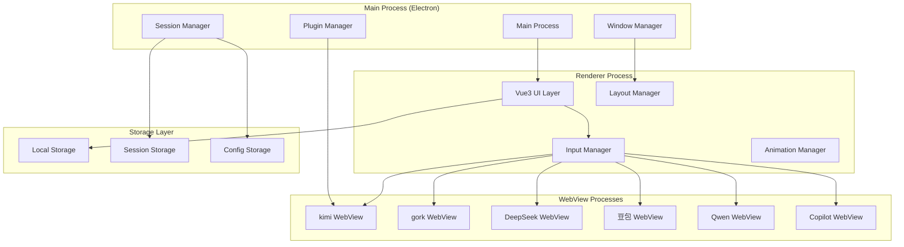

# Design Document

## Overview

ChatAllAI 是一个基于 Electron + Vue3 + TypeScript 的跨平台桌面应用程序，采用多进程架构设计。应用通过嵌入式 WebView 技术同时加载多个AI网站，实现统一的消息输入和分发机制，为用户提供多AI模型对话比较的能力。

### 核心设计理念
- **多进程隔离**：每个AI网站运行在独立的渲染进程中，确保稳定性和安全性
- **统一消息分发**：通过IPC通信机制实现消息的统一输入和分发
- **会话状态管理**：持久化存储各AI网站的登录状态和对话历史
- **响应式布局**：支持动态调整卡片大小和布局的响应式设计

## Architecture

### 整体架构图



### 技术栈选择
- **Electron**: 跨平台桌面应用框架
- **Vue3**: 现代化前端框架，支持Composition API
- **TypeScript**: 类型安全的JavaScript超集
- **Vite**: 快速的构建工具和开发服务器
- **Pinia**: Vue3状态管理库
- **Element Plus**: Vue3 UI组件库
- **Electron Builder**: 应用打包和分发工具

## Components and Interfaces

### 主要组件结构

```typescript
// 主进程组件
interface MainProcessComponents {
  app: ElectronApp;
  windowManager: WindowManager;
  sessionManager: SessionManager;
  pluginManager: PluginManager;
  ipcHandler: IPCHandler;
}

// 渲染进程组件
interface RendererComponents {
  app: Vue3App;
  inputManager: InputManager;
  layoutManager: LayoutManager;
  cardManager: CardManager;
  animationManager: AnimationManager;
}

// WebView组件
interface WebViewComponents {
  kimiView: WebViewInstance;
  gorkView: WebViewInstance;
  deepseekView: WebViewInstance;
  doubaoView: WebViewInstance;
  qwenView: WebViewInstance;
  copilotView: WebViewInstance;
}
```

### 核心接口定义

```typescript
// AI提供商接口
interface AIProvider {
  id: string;
  name: string;
  url: string;
  icon: string;
  isLoggedIn: boolean;
  sessionData: SessionData;
  webviewId: string;
}

// 消息接口
interface Message {
  id: string;
  content: string;
  timestamp: Date;
  sender: 'user' | 'ai';
  providerId: string;
  status: 'sending' | 'sent' | 'received' | 'error';
}

// 会话接口
interface Session {
  providerId: string;
  cookies: Cookie[];
  localStorage: Record<string, string>;
  sessionStorage: Record<string, string>;
  isActive: boolean;
}

// 布局配置接口
interface LayoutConfig {
  cardPositions: CardPosition[];
  cardSizes: CardSize[];
  gridLayout: GridLayout;
  theme: ThemeConfig;
}
```

## Data Models

### 数据模型设计

```typescript
// 应用状态模型
interface AppState {
  providers: AIProvider[];
  currentMessage: string;
  conversations: Record<string, Message[]>;
  layoutConfig: LayoutConfig;
  userPreferences: UserPreferences;
  pluginSettings: PluginSettings;
}

// 用户偏好设置
interface UserPreferences {
  theme: 'light' | 'dark' | 'auto';
  language: 'zh-CN' | 'en-US';
  autoSave: boolean;
  notifications: boolean;
  shortcuts: Record<string, string>;
}

// 卡片配置
interface CardConfig {
  id: string;
  providerId: string;
  position: { x: number; y: number };
  size: { width: number; height: number };
  isVisible: boolean;
  isMinimized: boolean;
  zIndex: number;
}

// 插件配置
interface PluginConfig {
  id: string;
  name: string;
  enabled: boolean;
  settings: Record<string, any>;
  permissions: string[];
}
```

### 数据持久化策略

```typescript
// 存储管理器
class StorageManager {
  // 会话数据存储（加密）
  async saveSession(providerId: string, session: Session): Promise<void>;
  async loadSession(providerId: string): Promise<Session | null>;
  
  // 对话历史存储
  async saveConversation(providerId: string, messages: Message[]): Promise<void>;
  async loadConversation(providerId: string): Promise<Message[]>;
  
  // 用户配置存储
  async saveUserConfig(config: UserPreferences): Promise<void>;
  async loadUserConfig(): Promise<UserPreferences>;
  
  // 布局配置存储
  async saveLayoutConfig(config: LayoutConfig): Promise<void>;
  async loadLayoutConfig(): Promise<LayoutConfig>;
}
```

## Error Handling

### 错误处理策略

```typescript
// 错误类型定义
enum ErrorType {
  NETWORK_ERROR = 'NETWORK_ERROR',
  AUTH_ERROR = 'AUTH_ERROR',
  WEBVIEW_ERROR = 'WEBVIEW_ERROR',
  PLUGIN_ERROR = 'PLUGIN_ERROR',
  STORAGE_ERROR = 'STORAGE_ERROR',
  SYSTEM_ERROR = 'SYSTEM_ERROR'
}

// 错误处理器
class ErrorHandler {
  // 网络错误处理
  handleNetworkError(error: NetworkError, providerId: string): void;
  
  // 认证错误处理
  handleAuthError(error: AuthError, providerId: string): void;
  
  // WebView错误处理
  handleWebViewError(error: WebViewError, webviewId: string): void;
  
  // 插件错误处理
  handlePluginError(error: PluginError, pluginId: string): void;
  
  // 存储错误处理
  handleStorageError(error: StorageError): void;
  
  // 系统错误处理
  handleSystemError(error: SystemError): void;
}

// 错误恢复机制
class ErrorRecovery {
  // 自动重试机制
  async retryWithBackoff(operation: () => Promise<any>, maxRetries: number): Promise<any>;
  
  // 会话恢复
  async recoverSession(providerId: string): Promise<boolean>;
  
  // WebView重启
  async restartWebView(webviewId: string): Promise<void>;
  
  // 应用状态恢复
  async recoverAppState(): Promise<void>;
}
```

### 用户友好的错误提示

```typescript
// 错误消息国际化
interface ErrorMessages {
  [ErrorType.NETWORK_ERROR]: {
    'zh-CN': '网络连接失败，请检查网络设置';
    'en-US': 'Network connection failed, please check network settings';
  };
  [ErrorType.AUTH_ERROR]: {
    'zh-CN': '登录已过期，请重新登录';
    'en-US': 'Login expired, please login again';
  };
  // ... 其他错误类型
}

// 错误通知组件
class ErrorNotification {
  showError(errorType: ErrorType, providerId?: string): void;
  showRetryOption(operation: () => Promise<void>): void;
  showRecoveryOptions(errorType: ErrorType): void;
}
```

## Testing Strategy

### 测试架构

```typescript
// 单元测试
interface UnitTestSuite {
  // 组件测试
  componentTests: {
    inputManager: InputManagerTest;
    cardManager: CardManagerTest;
    sessionManager: SessionManagerTest;
    layoutManager: LayoutManagerTest;
  };
  
  // 工具函数测试
  utilityTests: {
    storageManager: StorageManagerTest;
    errorHandler: ErrorHandlerTest;
    messageDispatcher: MessageDispatcherTest;
  };
}

// 集成测试
interface IntegrationTestSuite {
  // IPC通信测试
  ipcTests: IPCCommunicationTest;
  
  // WebView集成测试
  webviewTests: WebViewIntegrationTest;
  
  // 插件集成测试
  pluginTests: PluginIntegrationTest;
  
  // 存储集成测试
  storageTests: StorageIntegrationTest;
}

// E2E测试
interface E2ETestSuite {
  // 用户流程测试
  userFlowTests: {
    loginFlow: LoginFlowTest;
    messagingFlow: MessagingFlowTest;
    layoutFlow: LayoutFlowTest;
    settingsFlow: SettingsFlowTest;
  };
  
  // 跨平台测试
  platformTests: {
    macosTests: MacOSTest;
    windowsTests: WindowsTest;
  };
}
```

### 测试工具和框架

```typescript
// 测试配置
interface TestConfig {
  unitTesting: {
    framework: 'Vitest';
    coverage: 'c8';
    mocking: '@vitest/spy';
  };
  
  integrationTesting: {
    framework: 'Playwright';
    electronTesting: '@playwright/test';
  };
  
  e2eTesting: {
    framework: 'Spectron' | 'Playwright';
    crossPlatform: true;
  };
}

// 测试数据管理
class TestDataManager {
  // 模拟AI网站响应
  mockAIResponses(): MockResponse[];
  
  // 模拟用户输入
  mockUserInputs(): MockInput[];
  
  // 模拟会话数据
  mockSessionData(): MockSession[];
  
  // 清理测试数据
  cleanupTestData(): Promise<void>;
}
```

### 性能测试

```typescript
// 性能监控
interface PerformanceMetrics {
  // 应用启动时间
  startupTime: number;
  
  // 消息发送延迟
  messageSendLatency: number;
  
  // WebView加载时间
  webviewLoadTime: Record<string, number>;
  
  // 内存使用情况
  memoryUsage: MemoryUsage;
  
  // CPU使用情况
  cpuUsage: CPUUsage;
}

// 性能测试套件
class PerformanceTestSuite {
  // 启动性能测试
  testStartupPerformance(): Promise<PerformanceResult>;
  
  // 消息处理性能测试
  testMessageProcessingPerformance(): Promise<PerformanceResult>;
  
  // 内存泄漏测试
  testMemoryLeaks(): Promise<PerformanceResult>;
  
  // 长时间运行稳定性测试
  testLongRunningStability(): Promise<PerformanceResult>;
}
```