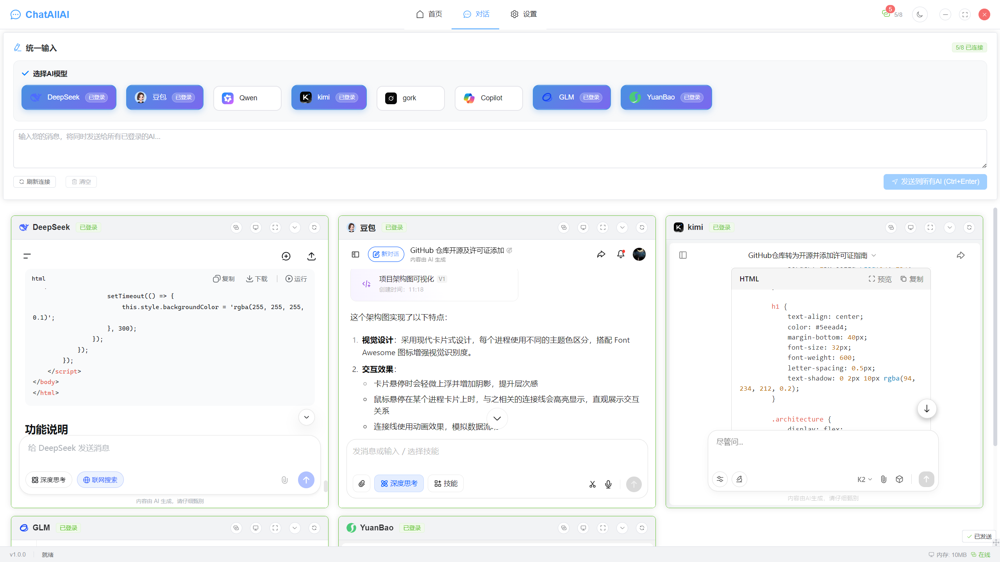
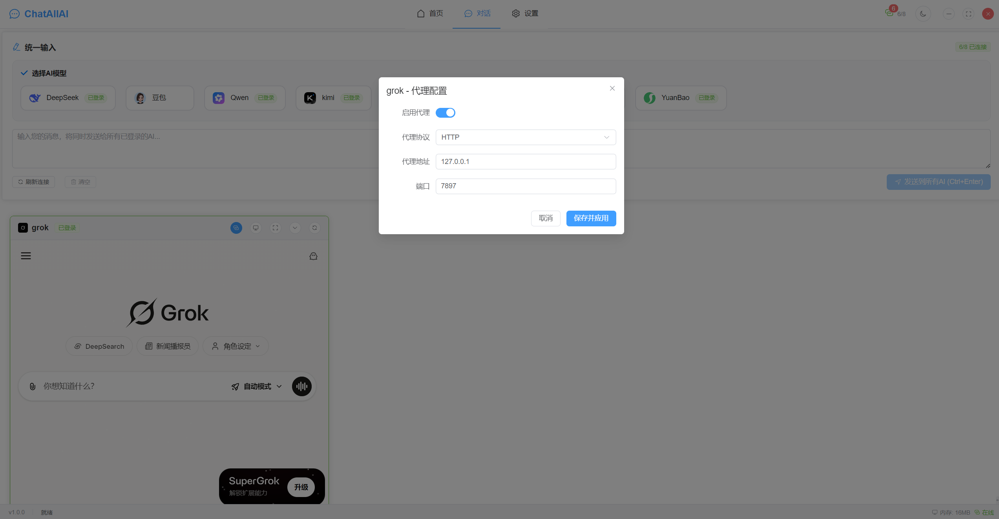
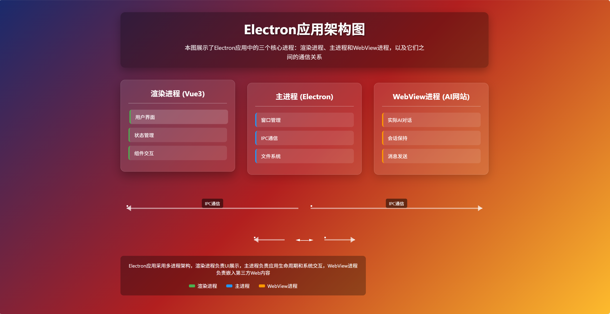

# ChatAllAI：多AI模型统一对话平台的技术架构与实践

## 项目概述

ChatAllAI是一个基于Electron + Vue3 + TypeScript构建的桌面应用程序，旨在解决用户需要同时与多个AI模型进行对话的痛点。通过单一界面，用户可以同时与DeepSeek、豆包、Qwen、Kimi、Grok、Copilot、GLM、元宝等主流AI模型进行对话，实现高效的多模型对比和协作。

## 开发动机与解决的问题

### 核心痛点
1. **多平台切换繁琐**：用户需要在不同浏览器标签页之间频繁切换，影响对话效率
2. **会话状态丢失**：每次重新打开网页都需要重新登录，无法保持会话状态
3. **对比分析困难**：难以直观比较不同AI模型对同一问题的回答质量
4. **资源浪费**：多个浏览器实例占用大量系统资源

### 解决方案
ChatAllAI通过以下方式解决上述问题：
- **统一界面**：将所有AI模型集成到单一桌面应用中
- **会话持久化**：自动保存登录状态和对话历史
- **并行对话**：一次输入，多模型同时响应
- **资源优化**：基于Electron的轻量级架构

## 功能特性详解

### 核心功能

#### 1. 多AI模型并行对话
- **统一输入**：单一输入框，一次输入即可发送到所有选中的AI模型
- **并行响应**：所有AI模型同时处理用户输入，实时返回结果
- **直观对比**：并排显示不同AI的回答，便于质量对比和分析

#### 2. 智能会话管理
- **自动登录保持**：首次登录后自动保存会话状态，无需重复登录
- **会话持久化**：应用重启后自动恢复所有对话历史
- **状态监控**：实时显示每个AI模型的连接状态和登录状态

#### 3. 灵活布局系统
- **响应式网格**：根据窗口大小自动调整卡片布局
- **拖拽调整**：支持卡片位置的自由拖拽和大小调整
- **最大化/最小化**：单个卡片支持全屏和最小化操作
- **多列布局**：可配置1-6列布局，适应不同屏幕尺寸

#### 4. 个性化配置
- **主题切换**：支持浅色、深色和跟随系统主题
- **语言支持**：中英文界面切换
- **快捷键**：支持Ctrl+Enter快速发送消息
- **通知设置**：可配置桌面通知和声音提示

#### 5. 高级功能
- **代理配置**：为每个AI模型单独配置网络代理
- **开发者工具**：可直接打开每个WebView的控制台
- **性能监控**：实时监控应用性能和资源使用情况
- **错误处理**：完善的错误提示和自动重试机制

### 支持的AI模型

目前支持以下主流AI模型：
- **DeepSeek**：深度求索AI助手
- **豆包**：字节跳动AI助手  
- **Qwen**：通义千问
- **Kimi**：月之暗面AI助手
- **Grok**：xAI的AI助手
- **Copilot**：微软AI助手
- **GLM**：智谱AI
- **元宝**：腾讯元宝

## 使用指南

### 快速开始

#### 1. 安装与启动
```bash
# 克隆项目
git clone https://github.com/hqzqaq/chatAllAI2.git

# 安装依赖
npm install

# 启动开发模式，默认打开控制台，原生菜单栏
npm run dev

# 启动生产模式，自定义菜单栏
npm run prod

# 构建应用
npm run build
```

#### 2. 首次使用步骤
1. **选择AI模型**：在左侧模型选择器中勾选需要使用的AI模型
2. **登录账号**：首次使用需要登录各个AI网站账号
3. **开始对话**：在统一输入框中输入问题，按Ctrl+Enter发送

### 界面操作详解

#### 主界面布局


#### 卡片操作功能
每个AI卡片都包含以下功能按钮：
- **🔗 连接状态**：显示当前连接和登录状态
- **🔧 代理设置**：配置网络代理（支持HTTP/HTTPS/SOCKS5）

- **🔍 开发者工具**：打开WebView控制台进行调试
- **⛶ 最大化**：将当前卡片全屏显示
- **⬇️ 最小化**：隐藏WebView内容，只显示标题栏
- **🔄 刷新**：重新加载当前WebView

#### 统一输入区域
- **模型选择**：通过复选框选择要发送消息的AI模型
- **智能提示**：根据选中模型数量显示相应提示F
- **快捷键支持**：Ctrl+Enter快速发送，Ctrl+A全选文本
- **状态指示**：显示当前发送状态和错误信息

### 高级使用技巧

#### 1. 高效对话策略
- **批量测试**：同时向多个AI发送相同问题，快速比较回答质量
- **渐进式提问**：先向所有AI发送基础问题，再针对优秀回答深入追问
- **结果聚合**：利用并排显示优势，快速筛选最优解决方案

#### 2. 布局优化建议
- **单列布局**：适合深度对比2-3个AI模型的回答
- **多列布局**：适合快速浏览多个AI的初步回答
- **最大化模式**：专注分析单个AI的详细回答

#### 3. 性能优化设置
- **选择性启用**：只启用当前需要的AI模型，减少资源占用
- **定时刷新**：长时间不使用的WebView可手动刷新保持活跃
- **代理配置**：网络不稳定时可配置代理提高连接稳定性

### 常见问题解决

#### 登录问题
- **问题**：某个AI模型无法保持登录状态
- **解决**：检查网络连接，尝试重新登录，或配置代理

#### 消息发送失败
- **问题**：消息发送后某个AI没有响应
- **解决**：检查该AI网站是否正常访问，WebView是否加载完成

#### 性能问题
- **问题**：同时启用多个AI模型导致应用卡顿
- **解决**：减少同时启用的模型数量，或升级硬件配置

## 技术架构深度解析

### 整体架构设计

ChatAllAI采用典型的前后端分离架构，但与传统Web应用不同，这里的"后端"实际上是Electron主进程：



### 核心技术栈

#### 前端技术栈
- **Vue3 + Composition API**：现代化响应式框架
- **TypeScript**：类型安全的开发体验
- **Pinia**：轻量级状态管理
- **Element Plus**：UI组件库
- **Vite**：快速构建工具

#### 桌面端技术栈
- **Electron**：跨平台桌面应用框架
- **IPC通信**：主进程与渲染进程间通信
- **WebView**：嵌入式浏览器组件

#### 开发工具链
- **ESLint + Prettier**：代码规范与格式化
- **Vitest**：单元测试框架
- **Electron Builder**：应用打包工具

### 核心模块设计

#### 1. 窗口管理系统
窗口管理器负责创建和管理所有应用窗口，包括：
- 主应用窗口
- 设置窗口
- 开发者工具窗口

```typescript
// WindowManager核心接口
export interface WindowConfig {
  id: string
  url?: string
  route?: string
  persistent?: boolean
}
```

#### 2. IPC通信系统
IPC处理器是连接主进程和渲染进程的桥梁：

```typescript
// IPC通道定义
export enum IPCChannel {
  APP_READY = 'app:ready',
  MESSAGE_SEND = 'message:send',
  WEBVIEW_CREATE = 'webview:create',
  // ...更多通道
}
```

#### 3. 消息分发器
消息分发器负责将用户输入同时发送到所有选中的AI模型：

```typescript
export class MessageDispatcher {
  async sendMessage(
    content: string,
    providers: AIProvider[],
    messageId?: string
  ): Promise<MessageSendResult[]> {
    // 并发发送到所有提供商
  }
}
```

#### 4. WebView管理
每个AI模型对应一个独立的WebView实例，实现会话隔离：

```typescript
export interface WebViewInstance {
  id: string
  providerId: string
  url: string
  isReady: boolean
  isLoading: boolean
}
```

## 新增AI模型网站接入指南

### 接入流程概述

新增AI模型网站接入主要涉及以下步骤：
1. 在 `src/stores/chat.ts` 中添加模型配置
2. 在 `src/utils/LoginCheckScripts.ts` 中实现登录检查脚本
3. 在 `src/utils/MessageScripts.ts` 中实现消息发送脚本
4. 添加图标资源文件

### 详细步骤说明

#### 步骤1：添加模型配置

在 `src/stores/chat.ts` 文件中添加新的AI提供商配置：

```typescript
// 在providers数组中添加新的提供商
{
  id: 'new-ai',                    // 唯一标识符，使用小写字母和连字符
  name: '新AI助手',                // 显示名称
  url: 'https://new-ai-website.com', // 网站URL
  icon: './icons/new-ai.png',      // 图标路径（位于public/icons目录）
  isLoggedIn: false,               // 登录状态
  sessionData: {                   // 会话数据
    cookies: [],
    localStorage: {},
    sessionStorage: {},
    isActive: false,
    lastActiveTime: new Date()
  },
  webviewId: 'webview-new-ai',     // WebView ID（格式：webview-{provider-id}）
  isEnabled: false,                // 是否启用
  loadingState: 'idle',            // 加载状态
  retryCount: 0                    // 重试次数
}
```

#### 步骤2：实现登录检查脚本

在 `src/utils/LoginCheckScripts.ts` 文件中添加登录检查脚本：

```typescript
// 在getLoginCheckScript函数中添加新的提供商脚本
new-ai: `
  // 检查新AI网站的登录状态
  // 通常通过检查用户头像、登录按钮状态、用户信息等元素
  !!(document.querySelector('[data-testid="user-avatar"]') ||
     document.querySelector('.user-info') ||
     document.querySelector('[class*="logout"]') ||
     !document.querySelector('[class*="login"]'))
`
```

#### 步骤3：实现消息发送脚本

在 `src/utils/MessageScripts.ts` 文件中添加消息发送脚本：

```typescript
// 在getSendMessageScript函数中添加新的提供商脚本
new-ai: getNewAIScript(escapedMessage)

// 实现具体的发送脚本函数
function getNewAIScript(escapedMessage: string): string {
  return `
    (function() {
      // 查找输入框
      const input = document.querySelector('[role="textbox"]') || 
                    document.querySelector('textarea') ||
                    document.querySelector('[contenteditable="true"]');
      
      if (input) {
        input.focus();
        
        // 清空现有内容
        if (input.tagName === 'TEXTAREA') {
          input.value = '';
        } else {
          input.textContent = '';
        }
        
        // 设置新消息
        if (input.tagName === 'TEXTAREA') {
          input.value = '${escapedMessage}';
        } else {
          input.textContent = '${escapedMessage}';
        }
        
        // 触发输入事件
        const inputEvent = new Event('input', { bubbles: true });
        input.dispatchEvent(inputEvent);
        
        // 查找发送按钮并点击
        const sendButton = document.querySelector('[class*="send"]') ||
                          document.querySelector('button[type="submit"]') ||
                          document.querySelector('button:contains("发送")');
        
        if (sendButton && !sendButton.disabled) {
          sendButton.click();
          return true;
        }
      }
      return false;
    })()
  `;
}
```

#### 步骤4：添加图标资源

在 `public/icons` 目录下添加对应的图标文件：
- `new-ai.png` (建议尺寸：32x32像素，支持PNG、SVG格式)

图标文件命名规范：
- 使用小写字母和连字符
- 与provider的id保持一致
- 例如：provider id为`new-ai`，图标文件名为`new-ai.png`

#### 技术实现细节

##### WebView组件集成

新增的AI模型网站会通过 `src/components/webview/WebView.vue` 组件进行集成。关键方法包括：

- `sendMessage`：调用消息发送脚本
- `checkLoginStatus`：定期检查登录状态
- `executeScript`：执行任意JavaScript代码

##### 脚本执行流程

1. **消息发送流程**：
   ```typescript
   // 在WebView组件中
   const sendScript = getSendMessageScript(props.provider.id, message)
   await webviewElement.value.executeJavaScript(sendScript)
   ```

2. **登录检查流程**：
   ```typescript
   // 每10秒检查一次登录状态
   const loginCheckScript = getLoginCheckScript(props.provider.id)
   const result = await webviewElement.value.executeJavaScript(loginCheckScript)
   const isLoggedIn = Boolean(result)
   ```

##### 错误处理机制

- **脚本执行失败**：捕获异常并记录错误日志
- **网络连接问题**：显示错误提示并允许重试
- **DOM元素未找到**：提供详细的调试信息

### 调试技巧

1. **使用浏览器开发者工具**：在目标AI网站上点击控制台的按钮打开开发者工具，使用元素选择器查找输入框和发送按钮的选择器
2. **测试脚本**：在开发者工具的Console中直接运行脚本测试效果
3. **错误处理**：确保脚本有完善的错误处理和日志输出

### 最佳实践

1. **选择器稳定性**：优先使用稳定的选择器（如`data-testid`、`role`等），避免使用易变的类名
2. **事件触发**：设置值后务必触发相应的事件（input、change等）
3. **延迟处理**：适当添加延迟以确保DOM操作完成
4. **兼容性**：考虑不同浏览器的兼容性，使用Polyfill解决差异
5. **安全性**：使用 `escapeJavaScriptString` 函数安全转义消息内容

### 常见问题解决

1. **脚本不执行**：检查选择器是否正确，确保DOM已完全加载
2. **登录状态检测失败**：可能需要等待页面完全加载后再检查
3. **消息发送失败**：检查发送按钮是否可用，可能需要等待输入框内容设置完成

## 技术实现原理

### 1. 多WebView会话管理

ChatAllAI的核心技术挑战是如何在单一应用中管理多个独立的浏览器会话。解决方案是：

- **会话隔离**：每个AI模型使用独立的WebView实例
- **Cookie持久化**：自动保存和恢复登录状态
- **本地存储同步**：保持localStorage和sessionStorage状态

### 2. 消息同步机制

消息同步通过以下步骤实现：

1. **统一输入**：用户在单一输入框中输入消息
2. **消息分发**：消息分发器将消息并发发送到所有选中的WebView
3. **状态监控**：实时监控每个WebView的消息发送状态
4. **结果聚合**：收集所有AI模型的响应并统一展示

### 3. 自适应布局系统

应用采用响应式网格布局，支持：
- **动态列数**：根据窗口大小自动调整列数
- **卡片拖拽**：支持卡片位置的自由调整
- **最大化/最小化**：单个卡片的全屏和最小化操作

## 项目特点与创新

### 技术特点
1. **模块化设计**：高度解耦的架构设计，便于维护和扩展
2. **类型安全**：全面使用TypeScript，减少运行时错误
3. **性能优化**：懒加载、虚拟滚动等优化技术
4. **跨平台支持**：支持Windows和macOS平台

### 用户体验创新
1. **统一操作**：一次输入，多模型响应
2. **直观对比**：并排显示不同AI的回答
3. **个性化配置**：支持主题切换、布局调整
4. **离线能力**：部分功能支持离线使用

## 技术挑战与解决方案

### 挑战1：WebView兼容性问题
**问题**：不同AI网站的DOM结构差异巨大
**解决方案**：为每个网站定制消息发送脚本

```typescript
// 定制化的消息发送脚本
export function getSendMessageScript(providerId: string, message: string): string {
  const scripts: Record<string, string> = {
    kimi: getKimiScript(message),
    deepseek: getDeepSeekScript(message),
    // ...其他提供商
  }
  return scripts[providerId]
}
```

### 挑战2：会话状态保持
**问题**：WebView重启后登录状态丢失
**解决方案**：实现完整的会话持久化机制

```typescript
// 会话数据接口
export interface SessionData {
  cookies: Cookie[]
  localStorage: Record<string, string>
  sessionStorage: Record<string, string>
  isActive: boolean
  lastActiveTime: Date
}
```

### 挑战3：性能优化
**问题**：多个WebView同时运行占用大量资源
**解决方案**：
- 懒加载：只有选中的模型才加载WebView
- 资源回收：长时间不使用的WebView自动销毁
- 内存优化：定期清理不必要的缓存数据

## 项目结构分析

### 核心目录结构

```
chat-all-ai/
├── electron/           # Electron主进程
│   ├── managers/       # 管理器模块
│   ├── main.ts        # 主进程入口
│   └── preload.ts     # 预加载脚本
├── src/               # Vue3渲染进程
│   ├── components/    # 组件层
│   ├── stores/       # 状态管理
│   ├── services/     # 服务层
│   ├── types/        # 类型定义
│   └── utils/        # 工具函数
├── public/           # 静态资源
└── scripts/          # 构建脚本
```

### 关键文件说明

1. **electron/main.ts**：应用主入口，负责初始化所有管理器
2. **src/App.vue**：应用根组件，设置全局样式和主题
3. **src/views/Chat.vue**：核心聊天界面，管理AI卡片布局
4. **src/stores/chat.ts**：聊天状态管理，包含所有AI提供商配置

## 存在的问题与局限性

### 技术限制
1. **WebView依赖**：应用功能受限于各AI网站的Web版本
2. **API稳定性**：网站DOM结构变化可能导致功能失效
3. **性能瓶颈**：同时运行多个WebView对硬件要求较高

### 功能限制
1. **模型支持有限**：目前仅支持主流AI模型
2. **自定义能力弱**：无法深度定制AI行为
3. **离线功能有限**：核心功能需要网络连接

### 安全考虑
1. **会话安全**：需要妥善处理用户登录信息
2. **数据隐私**：对话数据存储和传输的安全性
3. **更新维护**：需要持续跟进各AI网站的更新

## 下一步开发计划

### 短期目标（1-2个月）
1. **功能扩展**
   - 支持更多AI模型
   - 添加插件系统
   - 实现消息模板和快捷回复

2. **技术升级**
   - 迁移到Electron最新版本
   - 优化构建流程和打包大小
   - 添加自动化测试覆盖

## 技术实践建议

### 对于开发者
1. **架构设计**：采用模块化设计，便于维护和测试
2. **错误处理**：完善的错误处理和日志记录机制
3. **性能监控**：实时监控应用性能指标

### 对于用户
1. **硬件要求**：建议8GB以上内存以获得最佳体验
2. **网络环境**：稳定的网络连接是必要条件
3. **使用习惯**：合理选择需要同时使用的AI模型数量

## 总结

ChatAllAI项目展示了如何通过现代Web技术栈构建功能丰富的桌面应用程序。项目不仅解决了用户在多AI模型对话中的实际痛点，还提供了优秀的技术实践案例。

项目的成功得益于：
- **合理的技术选型**：Electron + Vue3 + TypeScript的组合
- **清晰的架构设计**：模块化、可扩展的代码结构
- **注重用户体验**：直观的界面和流畅的操作

## 开发工具
- trae-cn 主力模型为：deepseek-v3.1 terminal
- codebuddy
- qoder

## 许可证
MIT License
---

*本文基于ChatAllAI v1.0.0版本进行分析，技术细节可能随版本更新而变化。*