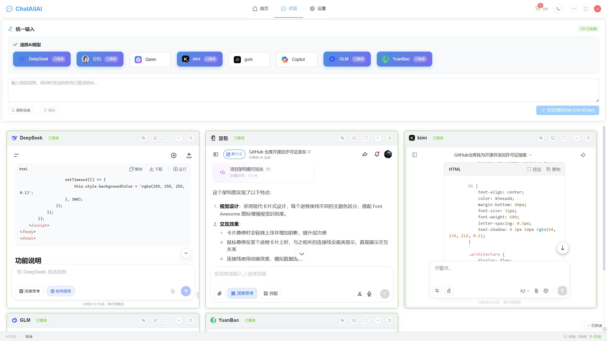
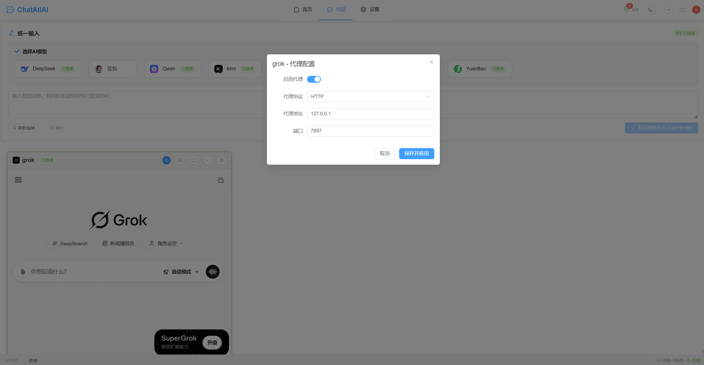
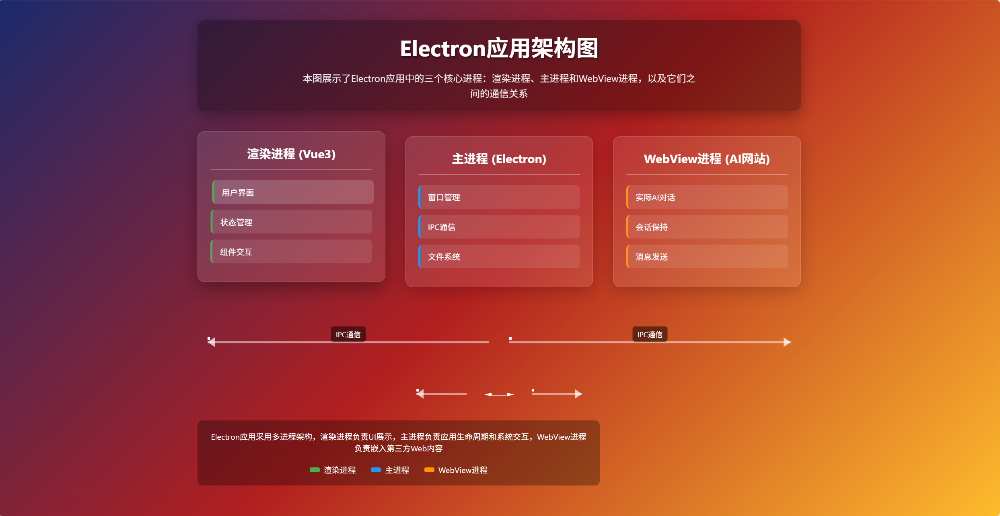
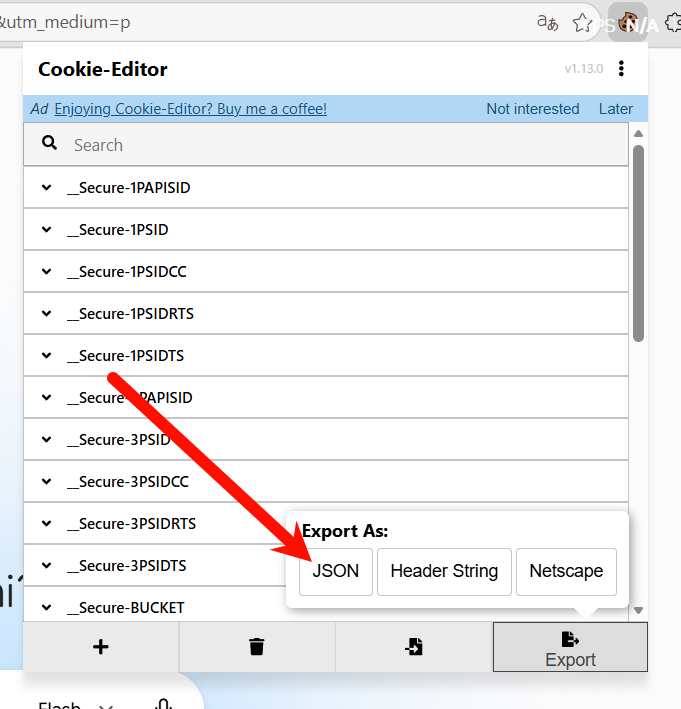
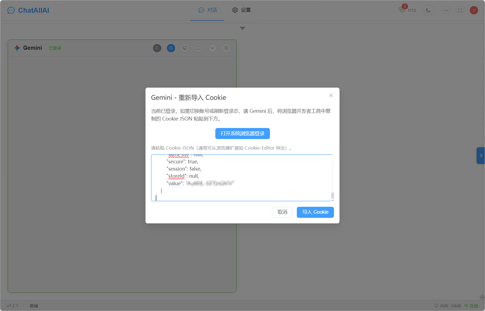

# ChatAllAI：多AI模型统一对话平台的技术架构与实践

## 项目概述

ChatAllAI是一个基于Electron + Vue3 + TypeScript构建的桌面应用程序，旨在解决用户需要同时与多个AI模型进行对话的痛点。通过单一界面，用户可以同时与DeepSeek、ChatGPT、Gemini、豆包、通义千问、Kimi、Grok、Copilot、GLM、元宝等主流AI模型进行对话，实现高效的多模型对比和协作。

## 开发动机与解决的问题

### 核心痛点
1. **多平台切换繁琐**：用户需要在不同浏览器标签页之间频繁切换，影响对话效率
2. **会话状态丢失**：每次重新打开网页都需要重新登录，无法保持会话状态
3. **对比分析困难**：难以直观比较不同AI模型对同一问题的回答质量
4. **资源浪费**：多个浏览器实例占用大量系统资源

### 解决方案
ChatAllAI通过以下方式解决上述问题：
- **统一界面**：将所有AI模型集成到单一桌面应用中
- **会话持久化**：自动保存登录状态和对话历史
- **并行对话**：一次输入，多模型同时响应
- **资源优化**：基于Electron的轻量级架构

## 功能特性详解

### 核心功能

#### 1. 多AI模型并行对话
- **统一输入**：单一输入框，一次输入即可发送到所有选中的AI模型
- **并行响应**：所有AI模型同时处理用户输入，实时返回结果
- **直观对比**：并排显示不同AI的回答，便于质量对比和分析

#### 2. 智能会话管理
- **自动登录保持**：首次登录后自动保存会话状态，无需重复登录
- **会话持久化**：应用重启后自动恢复所有对话历史
- **状态监控**：实时显示每个AI模型的连接状态和登录状态

#### 3. 灵活布局系统
- **响应式网格**：根据窗口大小自动调整卡片布局
- **拖拽调整**：支持卡片位置的自由拖拽和大小调整
- **最大化/最小化**：单个卡片支持全屏和最小化操作
- **多列布局**：可配置1-6列布局，适应不同屏幕尺寸

#### 4. 个性化配置
- **主题切换**：支持浅色、深色和跟随系统主题
- **语言支持**：中英文界面切换
- **快捷键**：支持Ctrl+Enter快速发送消息
- **通知设置**：可配置桌面通知和声音提示

#### 5. 高级功能
- **代理配置**：为每个AI模型单独配置网络代理
- **开发者工具**：可直接打开每个WebView的控制台
- **性能监控**：实时监控应用性能和资源使用情况
- **错误处理**：完善的错误提示和自动重试机制
- **文件上传**：支持为AI模型上传文件附件（支持豆包、DeepSeek、Kimi、ChatGPT、Gemini等）
- **AI总结**：支持选择特定AI模型进行回答总结，支持导出为多种格式
- **自定义脚本**：支持为每个AI提供商自定义JavaScript脚本（登录检查、消息发送、新建对话、状态监控、文件上传等）
- **Prompt管理**：支持自定义Prompt的创建、编辑、分类管理，支持日期时间变量
- **自定义提供商**：支持在应用内添加/编辑自定义AI模型，支持上传自定义图标
- **Cookie登录**：支持通过导入Cookie快速登录AI网站
- **视图层级管理**：智能管理原生视图的可见性，确保模态框、侧边栏等场景下的正确显示

### 支持的AI模型

目前支持以下主流AI模型：
- **DeepSeek**：深度求索AI助手
- **ChatGPT**：OpenAI官方模型
- **Gemini**：谷歌 AI 官方模型
- **MiroThinker**：小米搜索智能体
- **豆包**：字节跳动AI助手
- **通义千问**：阿里AI助手
- **Kimi**：月之暗面AI助手
- **Grok**：xAI的AI助手
- **Copilot**：微软AI助手
- **GLM**：智谱AI
- **元宝**：腾讯元宝
- **mimo**：小米 mimo
- **Minimax**：MiniMax Agent

此外支持通过"添加模型"功能自定义接入任意AI网站。

## 使用指南

### 快速开始

#### 1. 安装与启动
```bash
# 克隆项目
git clone https://github.com/hqzqaq/chatAllAI2.git

# 安装依赖
npm install

# 启动开发模式，默认打开控制台，原生菜单栏
npm run dev

# 启动生产模式，自定义菜单栏
npm run prod

# 构建应用
npm run build
```

`安装包下载地址：[https://github.com/hqzqaq/chatAllAI2/releases](https://github.com/hqzqaq/chatAllAI2/releases)
，mac系统安装之后，需要执行如下命令才可运行应用：`
```sh
sudo xattr -d com.apple.quarantine /Applications/ChatAllAI.app
```

#### 2. 首次使用步骤
1. **选择AI模型**：在左侧模型选择器中勾选需要使用的AI模型
2. **登录账号**：首次使用需要登录各个AI网站账号
3. **开始对话**：在统一输入框中输入问题，按Ctrl+Enter发送

### 界面操作详解

#### 主界面布局


#### 卡片操作功能
每个AI卡片都包含以下功能按钮：
- **🔗 连接状态**：显示当前连接和登录状态
- **🔧 代理设置**：配置网络代理（支持HTTP/HTTPS/SOCKS5）

- **🔍 开发者工具**：打开WebView控制台进行调试
- **⛶ 最大化**：将当前卡片全屏显示
- **⬇️ 最小化**：隐藏WebView内容，只显示标题栏
- **🔄 刷新**：重新加载当前WebView

#### 统一输入区域
- **模型选择**：通过复选框选择要发送消息的AI模型
- **智能提示**：根据选中模型数量显示相应提示
- **快捷键支持**：Ctrl+Enter快速发送，Ctrl+A全选文本
- **状态指示**：显示当前发送状态和错误信息

### 高级使用技巧

#### 1. 高效对话策略
- **批量测试**：同时向多个AI发送相同问题，快速比较回答质量
- **渐进式提问**：先向所有AI发送基础问题，再针对优秀回答深入追问
- **结果聚合**：利用并排显示优势，快速筛选最优解决方案

#### 2. 布局优化建议
- **单列布局**：适合深度对比2-3个AI模型的回答
- **多列布局**：适合快速浏览多个AI的初步回答
- **最大化模式**：专注分析单个AI的详细回答

#### 3. 性能优化设置
- **选择性启用**：只启用当前需要的AI模型，减少资源占用
- **定时刷新**：长时间不使用的WebView可手动刷新保持活跃
- **代理配置**：网络不稳定时可配置代理提高连接稳定性

### 常见问题解决

#### 登录问题
- **问题**：某个AI模型无法保持登录状态
- **解决**：检查网络连接，尝试重新登录，或配置代理

#### 消息发送失败
- **问题**：消息发送后某个AI没有响应
- **解决**：检查该AI网站是否正常访问，WebView是否加载完成

#### 性能问题
- **问题**：同时启用多个AI模型导致应用卡顿
- **解决**：减少同时启用的模型数量，或升级硬件配置

## 技术架构深度解析

### 整体架构设计

ChatAllAI采用典型的前后端分离架构，但与传统Web应用不同，这里的"后端"实际上是Electron主进程：



### 核心技术栈

#### 前端技术栈
- **Vue3 + Composition API**：现代化响应式框架
- **TypeScript**：类型安全的开发体验
- **Pinia**：轻量级状态管理
- **Element Plus**：UI组件库
- **Vite**：快速构建工具

#### 桌面端技术栈
- **Electron**：跨平台桌面应用框架
- **WebContentsView**：原生嵌入式浏览器视图（替代 webview 标签）
- **IPC通信**：主进程与渲染进程间通信
- **Handler 模式**：IPC 处理器按职责拆分为独立模块

#### 开发工具链
- **ESLint + Prettier**：代码规范与格式化
- **Vitest**：单元测试框架
- **Electron Builder**：应用打包工具

### 核心模块设计

#### 1. 窗口管理系统
窗口管理器负责创建和管理所有应用窗口，包括：
- 主应用窗口
- 设置窗口
- 开发者工具窗口

#### 2. IPC通信系统
IPC处理器采用 Handler 模式，按职责拆分为独立模块：

```
electron/managers/handlers/
├── AppControlHandler.ts    # 应用级控制（退出、重启等）
├── FileOperationHandler.ts # 文件操作（上传、导出等）
├── MessageHandler.ts       # 消息分发与AI回复收集
├── SessionHandler.ts       # 会话管理（Cookie导入等）
├── WebViewHandler.ts       # WebView控制（脚本注入、可见性等）
└── WindowControlHandler.ts # 窗口控制（最大化、最小化等）
```

#### 3. WebContentsView管理
每个AI模型对应一个独立的 WebContentsView 实例，通过 WebViewManager 统一管理：

```typescript
// WebViewManager 核心职责
export class WebViewManager extends EventEmitter {
  private views: Map<string, WebContentsView> = new Map()

  async createView(providerId: string, url: string, preloadPath: string): Promise<void>
  async destroyView(providerId: string): Promise<void>
  async setViewVisible(providerId: string, visible: boolean): Promise<void>
  async setViewBounds(providerId: string, bounds: Rectangle): Promise<void>
}
```

#### 4. 消息分发器
消息分发器负责将用户输入同时发送到所有选中的AI模型：

```typescript
export class MessageDispatcher {
  async sendMessage(
    content: string,
    providers: AIProvider[],
    messageId?: string
  ): Promise<MessageSendResult[]>
}
```

#### 5. 原生视图层级管理
由于 WebContentsView 是原生视图，不受 CSS z-index 控制，需要通过 `useViewLayering` composable 管理视图可见性：

```typescript
// 视图层级模式
type ViewLayerState = 'normal' | 'sidebar-expanded' | 'card-maximized' | 'dialog-open'

// useViewLayering 核心逻辑
export function useViewLayering() {
  async function syncAllViews(): Promise<void>
  async function setViewVisible(providerId: string, visible: boolean): Promise<void>
}
```

## 新增AI模型网站接入指南

### 接入流程概述

新增AI模型网站接入主要涉及以下步骤：
1. 在 `src/config/providers.ts` 中添加模型配置
2. 在 `src/utils/LoginCheckScripts.ts` 中实现登录检查脚本
3. 在 `src/utils/MessageScripts.ts` 中实现消息发送脚本
4. 在 `src/utils/NewChatScripts.ts` 中实现新建对话脚本
5. 在 `src/utils/StatusMonitorScripts.ts` 中实现状态监控脚本
6. 在 `src/utils/GetLLMLastMessage.ts` 中实现获取AI回复脚本
7. （可选）在 `src/utils/UploadScripts.ts` 中实现文件上传脚本
8. 添加图标资源文件

### 详细步骤说明

#### 步骤1：添加模型配置

在 `src/config/providers.ts` 文件中添加新的AI提供商配置：

```typescript
// 在providerConfigs数组中添加新的提供商
{
  id: 'new-ai',                    // 唯一标识符，使用小写字母和连字符
  name: '新AI助手',                // 显示名称
  url: 'https://new-ai-website.com', // 网站URL
  icon: './icons/new-ai.png',      // 图标路径（位于public/icons目录）
}
```
`createDefaultProvider()` 工厂函数会自动填充 `isLoggedIn`、`sessionData`、`webviewId`、`loadingState` 等默认字段。

#### 步骤2：实现登录检查脚本

在 `src/utils/LoginCheckScripts.ts` 文件中添加登录检查脚本，使用 `resolveScript` 处理自定义脚本覆盖：

```typescript
// 在getLoginCheckScript函数的scripts对象中添加
new-ai: `
  // 检查新AI网站的登录状态
  // 通常通过检查用户头像、登录按钮状态、用户信息等元素
  !!(document.querySelector('[data-testid="user-avatar"]') ||
     document.querySelector('.user-info') ||
     document.querySelector('[class*="logout"]') ||
     !document.querySelector('[class*="login"]'))
`
```

#### 步骤3：实现消息发送脚本

在 `src/utils/MessageScripts.ts` 文件中添加消息发送脚本：

```typescript
// 在getSendMessageScript函数的scripts对象中添加
new-ai: getNewAIScript(escapedMessage)

// 实现具体的发送脚本函数
function getNewAIScript(escapedMessage: string): string {
  return `
    (function() {
      const input = document.querySelector('[role="textbox"]') ||
                    document.querySelector('textarea') ||
                    document.querySelector('[contenteditable="true"]');

      if (input) {
        input.focus();
        if (input.tagName === 'TEXTAREA') {
          input.value = '${escapedMessage}';
        } else {
          input.textContent = '${escapedMessage}';
        }
        input.dispatchEvent(new Event('input', { bubbles: true }));

        const sendButton = document.querySelector('[class*="send"]') ||
                          document.querySelector('button[type="submit"]');
        if (sendButton && !sendButton.disabled) {
          sendButton.click();
          return true;
        }
      }
      return false;
    })()
  `;
}
```

#### 步骤4：实现新建对话脚本

在 `src/utils/NewChatScripts.ts` 文件中添加新建对话脚本。

#### 步骤5：实现状态监控脚本

在 `src/utils/StatusMonitorScripts.ts` 文件中添加AI回复状态监控脚本，用于检测AI是否正在生成回复。

#### 步骤6：实现获取AI回复脚本

在 `src/utils/GetLLMLastMessage.ts` 文件中添加获取AI最后一条回复的脚本。

#### 步骤7：（可选）实现文件上传脚本

如需支持文件上传功能，在 `src/utils/UploadScripts.ts` 文件中添加上传脚本。

#### 步骤8：添加图标资源

在 `public/icons` 目录下添加对应的图标文件：
- 支持 PNG、SVG、ICO 格式
- 建议尺寸：32x32像素
- 命名与 provider 的 id 保持一致

#### 技术实现细节

##### WebContentsView 组件集成

新增的AI模型网站会通过 `src/components/webview/WebView.vue` 组件进行集成。关键方法包括：

- `sendMessage`：调用消息发送脚本
- `checkLoginStatus`：定期检查登录状态
- `executeScript`：执行任意JavaScript代码

##### 脚本执行流程

1. **消息发送流程**：
   ```typescript
   // 在WebView组件中
   const sendScript = getSendMessageScript(props.provider.id, message)
   await webviewElement.value.executeJavaScript(sendScript)
   ```

2. **登录检查流程**：
   ```typescript
   // 每10秒检查一次登录状态
   const loginCheckScript = getLoginCheckScript(props.provider.id)
   const result = await webviewElement.value.executeJavaScript(loginCheckScript)
   const isLoggedIn = Boolean(result)
   ```

##### 脚本自定义覆盖

所有脚本类型都支持通过 `ScriptResolver` 进行自定义覆盖：

```typescript
// ScriptResolver 统一处理自定义脚本覆盖逻辑
export function resolveScript(providerId: string, scriptType: ScriptType, defaultScript: string): string
```

用户可在设置页面的"脚本配置"中为每个提供商自定义脚本，存储在 localStorage 中。

##### 错误处理机制

- **脚本执行失败**：捕获异常并记录错误日志
- **网络连接问题**：显示错误提示并允许重试
- **DOM元素未找到**：提供详细的调试信息

### 调试技巧

1. **使用浏览器开发者工具**：在目标AI网站上点击控制台的按钮打开开发者工具，使用元素选择器查找输入框和发送按钮的选择器
2. **测试脚本**：在开发者工具的Console中直接运行脚本测试效果
3. **错误处理**：确保脚本有完善的错误处理和日志输出

### 最佳实践

1. **选择器稳定性**：优先使用稳定的选择器（如`data-testid`、`role`等），避免使用易变的类名
2. **事件触发**：设置值后务必触发相应的事件（input、change等）
3. **延迟处理**：适当添加延迟以确保DOM操作完成
4. **兼容性**：考虑不同浏览器的兼容性，使用Polyfill解决差异
5. **安全性**：使用 `escapeJavaScriptString` 函数安全转义消息内容

### 常见问题解决

1. **脚本不执行**：检查选择器是否正确，确保DOM已完全加载
2. **登录状态检测失败**：可能需要等待页面完全加载后再检查
3. **消息发送失败**：检查发送按钮是否可用，可能需要等待输入框内容设置完成

## 技术实现原理

### 1. 多WebContentsView会话管理

ChatAllAI的核心技术挑战是如何在单一应用中管理多个独立的浏览器会话。解决方案是：

- **WebContentsView**：使用 Electron 原生 WebContentsView 替代 webview 标签，提供更好的性能和控制
- **Session隔离**：每个AI模型使用独立的 Electron Session，实现会话隔离
- **Cookie持久化**：通过 SessionManager 自动保存和恢复登录状态
- **视图层级管理**：通过 `useViewLayering` composable 管理原生视图的可见性（normal / sidebar-expanded / card-maximized / dialog-open 四种模式）

### 2. 消息同步机制

消息同步通过以下步骤实现：

1. **统一输入**：用户在单一输入框中输入消息
2. **消息分发**：MessageDispatcher 将消息并发发送到所有选中的 WebContentsView
3. **脚本注入**：通过 `executeJavaScript` 注入定制化的消息发送脚本
4. **状态监控**：StatusMonitorScripts 实时监控每个AI的回复状态
5. **结果聚合**：GetLLMLastMessage 收集所有AI模型的响应

### 3. 自适应布局系统

应用采用响应式网格布局，支持：
- **动态列数**：根据窗口大小自动调整列数
- **卡片拖拽**：支持卡片位置的自由调整
- **最大化/最小化**：单个卡片的全屏和最小化操作
- **原生视图同步**：布局变化时自动同步 WebContentsView 的位置和大小

## 项目特点与创新

### 技术特点
1. **模块化设计**：高度解耦的架构设计，IPC处理器按职责拆分
2. **类型安全**：全面使用TypeScript，减少运行时错误
3. **性能优化**：WebContentsView 原生视图、懒加载、视图可见性管理
4. **跨平台支持**：支持Windows和macOS平台
5. **脚本可扩展**：通过 ScriptResolver 支持自定义脚本覆盖

### 用户体验创新
1. **统一操作**：一次输入，多模型响应
2. **直观对比**：并排显示不同AI的回答
3. **个性化配置**：支持主题切换、布局调整、自定义提供商
4. **文件上传**：支持跨平台文件上传
5. **AI总结**：支持AI回答总结和导出
6. **Prompt管理**：支持Prompt模板和变量替换

## 技术挑战与解决方案

### 挑战1：WebView兼容性问题
**问题**：不同AI网站的DOM结构差异巨大
**解决方案**：为每个网站定制消息发送脚本，通过 ScriptResolver 支持自定义覆盖

```typescript
// 定制化的消息发送脚本
export function getSendMessageScript(providerId: string, message: string): string {
  const scripts: Record<string, string> = {
    kimi: getKimiScript(message),
    deepseek: getDeepSeekScript(message),
    // ...其他提供商
  }
  return resolveScript(providerId, 'sendMessage', scripts[providerId])
}
```

### 挑战2：会话状态保持
**问题**：WebContentsView 重启后登录状态丢失
**解决方案**：通过 SessionManager 管理独立的 Electron Session，实现会话持久化

```typescript
// 会话数据接口
export interface SessionData {
  cookies: Cookie[]
  localStorage: Record<string, string>
  sessionStorage: Record<string, string>
  isActive: boolean
  lastActiveTime: Date
  loginUrl?: string
}
```

### 挑战3：性能优化
**问题**：多个 WebContentsView 同时运行占用大量资源
**解决方案**：
- 懒加载：只有选中的模型才创建 WebContentsView
- 资源回收：长时间不使用的视图自动销毁
- 视图可见性管理：不可见的视图移到屏幕外，减少渲染开销

### 挑战4：原生视图层级管理
**问题**：WebContentsView 是原生视图，不受 CSS z-index 控制
**解决方案**：通过 `useViewLayering` composable 管理视图可见性，支持四种层级模式

```typescript
// 视图层级模式
type ViewLayerState = 'normal' | 'sidebar-expanded' | 'card-maximized' | 'dialog-open'

// 模式切换时自动同步视图可见性
watch(() => layoutStore.viewLayerState, () => syncAllViews())
```

## 项目结构分析

### 核心目录结构

```
chat-all-ai/
├── electron/                # Electron主进程
│   ├── managers/            # 管理器模块
│   │   ├── handlers/        # IPC处理器（按职责拆分）
│   │   │   ├── AppControlHandler.ts    # 应用控制
│   │   │   ├── FileOperationHandler.ts # 文件操作
│   │   │   ├── MessageHandler.ts       # 消息处理
│   │   │   ├── SessionHandler.ts       # 会话管理
│   │   │   ├── WebViewHandler.ts       # WebView控制
│   │   │   └── WindowControlHandler.ts # 窗口控制
│   │   ├── IPCHandler.ts       # IPC通信注册中心
│   │   ├── SessionManager.ts   # 会话持久化管理
│   │   ├── WebViewManager.ts   # WebContentsView生命周期管理
│   │   └── WindowManager.ts    # 窗口生命周期管理
│   ├── main.ts            # 主进程入口
│   ├── preload.ts         # 预加载脚本（主窗口）
│   ├── webview-preload.ts # WebView预加载脚本
│   └── utils.ts           # 主进程工具函数
├── src/                   # Vue3渲染进程
│   ├── components/        # 组件层
│   │   ├── chat/          # 聊天相关 (AICard, UnifiedInput, SummaryCard, PromptManager, AddProviderDialog)
│   │   ├── webview/       # WebView封装 (WebView)
│   │   ├── layout/        # 布局组件 (AppLayout, AppHeader, AppFooter)
│   │   ├── summary/       # 总结组件 (SummarySidebar, ModelSelectDialog)
│   │   ├── session/       # 会话组件 (SessionStatus)
│   │   └── settings/      # 设置组件 (ScriptEditor)
│   ├── composables/       # 组合函数
│   │   ├── useLoginCheck.ts        # 登录状态检测
│   │   ├── useSessionPersistence.ts # 会话保存/恢复
│   │   ├── useWebViewEvents.ts     # WebView事件绑定
│   │   ├── useSummary.ts           # AI总结流程
│   │   └── useViewLayering.ts      # 原生视图层级管理
│   ├── config/            # 配置层 (providers.ts)
│   ├── stores/            # 状态管理 (Pinia)
│   │   ├── app.ts         # 应用全局状态
│   │   ├── chat.ts        # 聊天状态
│   │   ├── layout.ts      # 布局状态
│   │   ├── scriptConfig.ts # 自定义脚本配置
│   │   └── summary.ts     # 总结状态
│   ├── services/          # 服务层 (MessageDispatcher, SummaryService)
│   ├── types/             # 类型定义 (index, ipc, events, errors, summary, scriptConfig)
│   ├── utils/             # 工具函数
│   │   ├── LoginCheckScripts.ts    # 登录检查脚本
│   │   ├── MessageScripts.ts       # 消息发送脚本
│   │   ├── NewChatScripts.ts       # 新建对话脚本
│   │   ├── StatusMonitorScripts.ts # 状态监控脚本
│   │   ├── GetLLMLastMessage.ts    # 获取AI回复脚本
│   │   ├── UploadScripts.ts        # 文件上传脚本
│   │   ├── ScriptResolver.ts       # 脚本解析工具
│   │   ├── ScriptTemplates.ts      # 脚本模板
│   │   ├── SummaryExport.ts        # 总结导出工具
│   │   ├── SummaryPrompts.ts       # 总结提示词
│   │   ├── storage.ts              # localStorage封装
│   │   └── webviewHelper.ts        # WebView ID工具
│   ├── views/             # 页面视图 (Chat, Settings, Home)
│   └── router/            # 路由配置
├── public/               # 静态资源 & AI提供商图标
└── scripts/              # 构建脚本 (dev, prod, build-prod, test-build)
```

### 关键文件说明

1. **electron/main.ts**：应用主入口，负责初始化所有管理器
2. **electron/managers/IPCHandler.ts**：IPC 通信注册中心，统一注册所有 handler
3. **electron/managers/handlers/**：按职责拆分的 IPC 处理器（AppControl、FileOperation、Message、Session、WebView、WindowControl）
4. **electron/managers/WebViewManager.ts**：管理 WebContentsView 实例的创建、销毁、事件转发和可见性控制
5. **electron/managers/SessionManager.ts**：管理 Electron Session，实现会话隔离和持久化
6. **src/App.vue**：应用根组件，设置全局样式和主题
7. **src/views/Chat.vue**：核心聊天界面，管理 AI 卡片布局
8. **src/config/providers.ts**：AI 提供商配置数据层，通过 `createDefaultProvider()` 工厂函数统一创建
9. **src/composables/useLoginCheck.ts**：登录状态检测组合函数
10. **src/composables/useSessionPersistence.ts**：会话保存/恢复组合函数
11. **src/composables/useWebViewEvents.ts**：WebView 事件绑定组合函数
12. **src/composables/useSummary.ts**：AI 总结流程组合函数
13. **src/composables/useViewLayering.ts**：原生 WebContentsView 层级管理组合函数
14. **src/utils/ScriptResolver.ts**：公共脚本解析工具，统一处理自定义脚本覆盖逻辑
15. **src/utils/UploadScripts.ts**：各平台文件上传注入脚本
16. **src/utils/StatusMonitorScripts.ts**：AI 回复状态监控脚本
17. **src/utils/storage.ts**：统一 localStorage 操作封装（类型安全）
18. **src/utils/webviewHelper.ts**：WebView ID 构建/解析工具函数
19. **src/components/chat/AddProviderDialog.vue**：自定义 AI 提供商添加/编辑对话框
20. **src/components/chat/PromptManager.vue**：Prompt 管理组件
21. **src/components/settings/ScriptEditor.vue**：自定义脚本编辑器

## 存在的问题与局限性

### 技术限制
1. **WebContentsView依赖**：应用功能受限于各AI网站的Web版本
2. **API稳定性**：网站DOM结构变化可能导致脚本失效
3. **性能瓶颈**：同时运行多个WebContentsView对硬件要求较高
4. **原生视图限制**：WebContentsView 不受 CSS 控制，需要额外的层级管理

### 功能限制
1. **模型支持有限**：目前仅支持主流AI模型（但可通过自定义提供商扩展）
2. **自定义能力弱**：无法深度定制AI行为
3. **离线功能有限**：核心功能需要网络连接

### 安全考虑
1. **会话安全**：需要妥善处理用户登录信息
2. **数据隐私**：对话数据存储和传输的安全性
3. **更新维护**：需要持续跟进各AI网站的更新

## 下一步开发计划

### 短期目标（1-2个月）
1. **功能扩展**
   - ✅ 支持更多AI模型
   - ✅ 支持一键新建对话
   - ✅ 支持AI对话状态监控
   - ✅ 实现prompt管理

2. **技术升级**
   - ✅ Github自动化打包流程构建
   - ✅ 优化构建流程和打包大小

## 技术实践建议

### 对于开发者
1. **架构设计**：采用模块化设计，便于维护和测试
2. **错误处理**：完善的错误处理和日志记录机制
3. **性能监控**：实时监控应用性能指标

### 对于用户
1. **硬件要求**：建议8GB以上内存以获得最佳体验
2. **网络环境**：稳定的网络连接是必要条件
3. **使用习惯**：合理选择需要同时使用的AI模型数量

## 总结

ChatAllAI项目展示了如何通过现代Web技术栈构建功能丰富的桌面应用程序。项目不仅解决了用户在多AI模型对话中的实际痛点，还提供了优秀的技术实践案例。

项目的成功得益于：
- **合理的技术选型**：Electron + Vue3 + TypeScript的组合
- **清晰的架构设计**：模块化、可扩展的代码结构
- **注重用户体验**：直观的界面和流畅的操作

## 开发工具
- trae-cn
- codebuddy
- qoder

## 许可证
MIT License

## 版本更新记录

### v1.2.1
- **功能新增**：实现 Cookie 登录功能
  - 新增 Cookie 登录对话框，支持通过导入 Cookie 快速登录 AI 网站
  - 新增通用 Cookie 导入后端，支持gemini、grok、chatgpt的 Cookie 导入，绕过登录检测
  - 推荐使用Cookie-editor插件导出登录的Cookie
  
  - 导入Cookie后，应用会自动登录AI网站，无需手动操作
  

- **功能新增**：新增 Gemini 状态监控与新建对话支持
  - 添加 Gemini AI 状态监控脚本
  - 添加 Gemini 新建对话脚本
- **架构重构**：重构 WebView 管理与状态监控
  - 重构 WebView 管理为独立 WebViewManager 模块
  - 通用化状态监控与会话代理逻辑
  - 移除旧监控功能相关代码，优化 AI 状态处理逻辑
  - 统一使用 ScriptResolver，消除 resolveScript 重复实现
  - 升级 Electron 到 30.5.1
- **架构重构**：简化各平台登录检测脚本
- **bug修复**：修复 AI 卡片最大化时被滚动容器裁剪的问题
- **bug修复**：修复 SummarySidebar collapsed 警告及频繁保存 session 的问题
- **bug修复**：修复 AI 状态监控启动误判失败的问题
- **bug修复**：修复 Copilot 登录检测逻辑，新增获取最后消息脚本
- **bug修复**：更新 Gemini 登录检测选择器
- **bug修复**：更新通义千问输入框选择器
- **bug修复**：更新 Grok 状态监控和消息获取的选择器
- **bug修复**：新增 Qwen 获取最后消息脚本
- **bug修复**：重写 Gemini 上传脚本适配新 UI
- **bug修复**：从 Cookie 导入提供商列表中移除 Copilot

### v1.2.0
- **功能新增**：实现自定义 AI 提供商管理功能
  - 新增 `AddProviderDialog` 组件，支持在应用内添加/编辑自定义 AI 模型
  - 在统一输入组件中新增"添加模型"入口，支持快速接入未内置的 AI 网站
  - 在设置页新增"提供商管理"模块，提供列表展示、编辑、删除自定义模型
  - 自定义提供商信息（名称、URL、图标）持久化至 `localStorage`，重启应用后自动恢复
  - 自定义模型支持上传 PNG / JPG / ICO / SVG 格式图标
  - chat store 新增 `addCustomProvider` / `updateCustomProvider` / `removeCustomProvider` 等方法，统一内置与自定义提供商的管理入口
- **优化调整**：优化登录检查脚本与 WebView 日志
  - 调整 `LoginCheckScripts` 中部分逻辑，提升登录状态检测稳定性
  - 优化 `useWebViewEvents` 事件回调日志，便于排查 WebView 异常
- **bug修复**：修复多 AI 会话相关问题
  - 更新豆包页面消息选择器，适配新 DOM 结构，恢复豆包消息获取功能
  - 调整 WebView 安全策略（`websecurity`、`disablewebsecurity` 等），提升多站点兼容性
  - 重构 Electron Cookie 处理逻辑，放宽跨域限制，修复 Google 登录流程
  - 将 AI 回答收集改为串行执行，避免并发执行脚本导致的竞态条件
  - 简化 `SummaryService` 结果处理流程，减少无效重排与冗余逻辑
  - 同步更新 `GetLLMLastMessage` 中豆包选择器

### v1.1.9
- **功能新增**：实现多平台文件上传功能
  - 支持为每个 AI 提供商（目前支持豆包、deepseek、kimi、mimo、元宝）上传文件附件
  - 添加文件上传脚本基础设施，支持各平台定制化上传逻辑
  - 支持上传进度反馈和错误处理
  - 添加文件附件在聊天界面的展示功能
- **功能增强**：优化 AI 卡片状态管理与布局
  - 重构 AI 卡片组件，优化状态管理逻辑
  - 为路由视图添加 `keep-alive` 缓存组件，提升切换性能
  - 优化 Prompt 编辑器功能
- **架构重构**：系统性优化项目代码结构
  - 抽取 `src/config/providers.ts` 配置数据层，消除 chat store 中 ~200 行重复对象定义
  - 创建 `createDefaultProvider()` 工厂函数，新增提供商只需填写 4 个可变字段
  - 抽取 `src/utils/ScriptResolver.ts` 公共脚本解析工具，消除 3 个文件中的 `resolveScript` 重复实现
  - 创建 `src/utils/webviewHelper.ts` WebView ID 构建/解析工具函数
  - 创建 `src/utils/storage.ts` 统一 localStorage 操作封装（类型安全）
  - 拆分 WebView.vue 为 3 个组合函数：`useLoginCheck`、`useSessionPersistence`、`useWebViewEvents`
  - 创建 `src/components/chat/SummaryCard.vue` 独立总结卡片组件，移除 AICard 中的 `isSummaryCard` 分支
  - 创建 `src/composables/useSummary.ts` 总结流程组合函数
  - IPCHandler 抽取 `executeInWebViewContainer()` 公共方法，消除 5 处重复模板代码
  - 移除单例模式的 SummaryService，清理死代码 WebViewManager.vue 及 IPCHandler 空桩 handler
  - 修复 WebView 元素选择器冲突（容器 div 与 webview 共用 id 导致 querySelector 错误匹配）

### v1.1.8
- **功能新增**：实现自定义脚本配置功能
  - 支持为每个AI提供商自定义 JavaScript 脚本
  - 支持自定义脚本类型：获取AI回复、登录状态检查、发送消息、新建对话、状态监控
  - 提供脚本编辑器，支持代码高亮和语法提示
  - 支持脚本参数模板替换（如 `{{message}}`、`{{providerId}}` 等）
  - 支持脚本配置的导入/导出功能
  - 在设置页面新增脚本配置入口
- **bug修复**：修复聊天输入框选择器定位问题
  - 优化消息发送脚本中的输入框选择器逻辑
  - 提升消息发送的稳定性和兼容性

### v1.1.6
- **功能新增**：添加AI回答总结功能
  - 支持选择特定AI模型进行回答总结
  - 优化总结执行流程和侧边栏交互
  - 支持侧边栏默认折叠状态配置
- **功能新增**：添加AI消息获取功能
  - 支持获取豆包、DeepSeek、GLM、Miromind、元宝、Minimax、Mimo、Grok、Kimi等模型的最后消息
  - 添加AI消息获取脚本工具函数
- **功能新增**：添加输入框折叠/收起功能
  - 支持输入框的展开和收起操作
  - 优化输入区域的空间利用
- **bug修复**：修复Kimi消息选择器以正确获取最后一条消息
- **bug修复**：修复Mimo服务URL配置问题
- **bug修复**：修正新对话按钮选择器
- **优化**：简化登录状态检查逻辑
- **优化**：简化网页视图导航逻辑

### v1.1.5
- **功能新增**：添加日期时间变量支持
  - 在 Prompt 管理器中添加 {{date}} 变量（格式：YYYY-MM-DD）
  - 在 Prompt 管理器中添加 {{datetime}} 变量（格式：YYYY-MM-DD HH:mm:ss）
  - 应用 Prompt 时自动替换为当前日期时间
- **bug修复**：修复 miromind 新建对话问题
  - 优化 miromind 新建对话脚本逻辑
  - 修正按钮定位选择器

### v1.1.4
- **新增模型**：添加 Minimax AI 服务支持
  - 添加 Minimax 提供商配置
  - 实现 Minimax 登录状态检测脚本
  - 实现 Minimax 消息发送脚本
  - 实现 Minimax 新建对话脚本
  - 添加 Minimax 状态监控脚本
  - 添加 Minimax 图标资源
  - 修复 kimi 无法新建对话

### v1.1.3
- **bug修复**：修复新建对话无效的问题
  - 修复 mac 系统下，豆包无法新建对话
  - 修复 miromind 无法新建对话

### v1.1.2
- **新增模型**：增加对 Mimo 平台的支持
  - 添加 Mimo 平台的完整接入
  - 实现登录状态检测、消息发送和新建对话功能
- **功能增强**：添加提示词分类管理功能
  - 支持提示词的分类创建、编辑和删除
  - 优化提示词管理界面，提升用户体验
- **性能优化**：优化 ChatGPT Provider 处理逻辑
  - 添加对 ChatGPT provider 的特殊处理
  - 避免对 ChatGPT 网页频繁执行 JavaScript，提升性能
- **bug修复**：修复消息发送按钮选择器错误
  - 修正消息发送脚本中的按钮选择器问题
  - 确保消息能够正确发送到各个AI模型

### v1.1.1
- **功能新增**：添加 Prompt 管理功能
  - 支持自定义 Prompt 的创建、编辑和删除
  - 提供 Prompt 分类管理功能
  - 支持快捷 Prompt 功能，快速应用常用 Prompt
- **功能增强**：添加提供商拖拽排序功能
  - 在 UnifiedInput 组件中实现拖拽功能
  - 支持提供商顺序的灵活调整
  - 提升用户个性化配置体验
- **构建优化**：添加 macOS 多架构构建支持
  - 支持 Intel 和 Apple Silicon 架构
  - 优化构建配置，提升构建效率
- **bug修复**：修复 Grok 消息发送问题
  - 解决 Grok 模型消息发送失败的问题
  - 优化消息发送脚本逻辑

### v1.1.0
- **新增模型**：增加对 ChatGPT 的支持
- **新增模型**：增加对 Gemini 的支持
- **新增模型**：增加对 Miromind 的支持
- **功能增强**：优化统一输入组件中的提供商排序逻辑
  - 改进提供商排序算法
  - 提升用户体验
- **功能增强**：优化窗口管理器配置
  - 改进窗口管理机制
  - 优化脚本执行配置
- **bug修复**：修复聊天组件功能问题
  - 修复聊天组件中的功能异常
  - 提升组件稳定性
- **bug修复**：优化 ChatGPT 登录状态检查逻辑
  - 改进登录状态检测机制
  - 提高检测准确性
- **bug修复**：修复用户代理设置问题
  - 修复用户代理配置错误
  - 确保代理设置正常工作
- **bug修复**：修复登录检查脚本中的选择器
  - 修正登录状态检查的选择器问题
  - 提升登录检测的可靠性
- **bug修复**：更新 Grok 登录状态检测逻辑
  - 优化 Grok 登录状态检测
  - 简化检测逻辑

### v1.0.9
- **功能增强**：实现代理配置的加载与保存功能
- **UI优化**：移除连接状态标签显示
- **模型更新**：更新Grok服务URL并优化状态监控脚本
- **模型更新**：更新GLM链接并优化状态监控脚本
- **模型更新**：更新通义千问URL地址（从tongyi.com修改为qianwen.com）
- **监控增强**：调整AI状态监控脚本的超时和检查频率，增加Kimi监控脚本
- **监控增强**：添加多个AI模型状态监控脚本，重构通用状态监控脚本以支持不同选择器
- **监控增强**：增加对DeepSeek和豆包回答状态的监控
- **监控增强**：完善回答状态检测流程定义
- **输入优化**：增强豆包输入框发送功能
  - 支持拖拽调整输入框大小
  - 实现全屏展开/收起输入框功能
  - 支持根据内容自动调整输入框高度
- **脚本优化**：优化Qwen新建对话脚本逻辑
- **脚本优化**：优化通义千问状态监控脚本
- **脚本优化**：重构豆包和元宝状态监控脚本实现
- **bug修复**：优化AI提供商连接状态显示错误

### v1.0.8
- **新增功能**：增加快捷键ctrl+数字键控制 AI 卡片缩放
- **优化体验**：优化AI卡片初始化和显示逻辑
- **布局改进**：移除网格布局行数限制，优化布局初始化和配置加载逻辑
- **构建优化**：优化构建配置和资源管理，减少压缩包大小
- **路由调整**：移除首页路由并重定向到对话页面
- **功能增强**：新增webview页面刷新功能
- **bug修复**：修复模型卡片未选中时，出现tag已登录的问题

---

*本文基于ChatAllAI v1.2.1版本进行分析，技术细节可能随版本更新而变化。*
